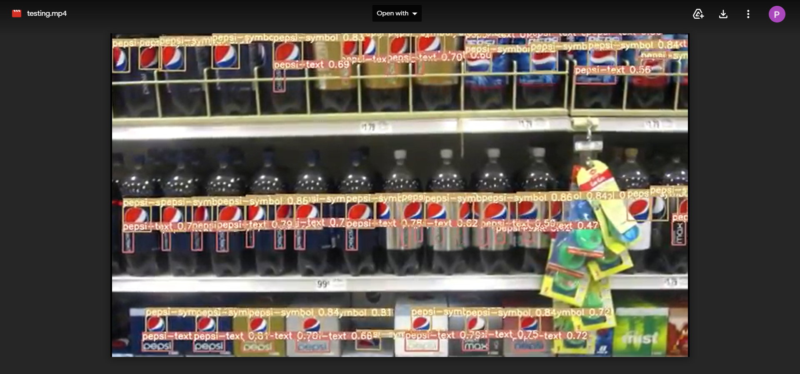

# Logo-Detection-using-YOLO

This repository contains the code that converts FlickrLogo-47 Dataset annotations to the format required by YOLO. It also has the YOLO configuration file used for the Logo Detection.

## Project Description

Companies and advertisers need to know their customers to assess their business and marketing strategies. While the amount of information shared on social media platforms is gargantuan, a lot of it is unstructured and untagged, and particularly so for visual data. Users can voluntarily tag their preferred brands in their posts, but wouldn't it be much better for the companies to know every time their brand is being publicly shared?

In this project, we built a general-purpose logo detection API. It detects all the brands that have been displayed in a video and accumulates the data for further analysis. 

.png)

.png)

## Instructions for the training process
1) Move dataset.zip to logo-detection/data/ and unzip it there
2) Run the data_augmentation_final notebook to augment the images present in logo-detection/data/dataset
3) compress dataset and upload it on your google drive account
4) Open train.ipynb on google colab and mount your google drive account there, move the compressed dataset.zip file from content/gdrive/My Drive to /content
5) After you unzip the dataset.zip file, move the train and valid folders to content/ and the data.yaml file to content/yolov5
6) Manually change the value of 'nc' in content/yolov5/models/yolov5l from '80' to '527'

## Instructions for the detection process
1) Upload the video in which you wish to run your detection on google drive
2) Open detect.ipynb in google colab and mount your google drive account
3) Move the video from content/gdrive/My Drive to content/ and your best_fin.pt file to content/yolov5/weights
